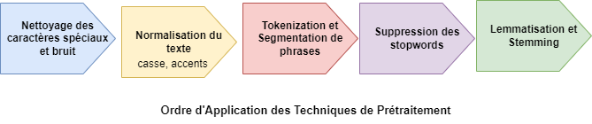

# TPs Traitement Automatique de la Langue Naturelle TALN

Le prétraitement du texte constitue une étape essentielle du traitement automatique du langage naturel (TALN).
Le schéma suivant illustre les principales étapes d’un pipeline typique de préparation des données textuelles avant leur analyse.

Ce dépôt contient les implémentations pratiques des travaux pratiques (TPs) proposés dans le cadre du cours “Traitement Automatique de la Langue Naturelle (TALN)”.

TPs réalisés par Dr. Lydia Lazib

